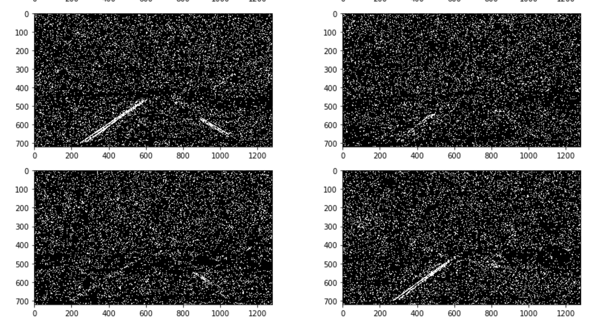

## **Advanced Lane Finding Project**

The goals / steps of this project are the following:

* Compute the camera calibration matrix and distortion coefficients given a set of chessboard images.
* Apply a distortion correction to raw images.
* Use color transforms, gradients, etc., to create a thresholded binary image.
* Apply a perspective transform to rectify binary image ("birds-eye view").
* Detect lane pixels and fit to find the lane boundary.
* Determine the curvature of the lane and vehicle position with respect to center.
* Warp the detected lane boundaries back onto the original image.
* Output visual display of the lane boundaries and numerical estimation of lane curvature and vehicle position.

## [Rubric](https://review.udacity.com/#!/rubrics/571/view) Points

### Here I will consider the rubric points individually and describe how I addressed each point in my implementation.  

---

### Camera Calibration

#### 1. Briefly state how you computed the camera matrix and distortion coefficients. Provide an example of a distortion corrected calibration image.

I develop three wrapper functions to do the camera calibration. In the code block 3 of the jupyter notebook, a function called points is used to generate the object points and image points from the chessboard images.

The object points are the replicated positions that we specified for the 3d real world position , while the image points are the target point positions that we are interested in on the distorted chessboard found using the ```cv2.findchessboard()``` function.

After I recorded the object points and the image points, I wrote another wrapper function ```cam_cal()``` to calculate the most important values to undistort and image, the ```mtx``` and ```dist```.

Then I used the ```cv2.undistort()``` function to undistort any given image.

Here is the result of an distorted road image:


Here is the image after undistortion:


We can clearly see the difference between the two from the image edges.

### Pipeline (four testing images)

The pipeline and the functions developed for the pipeline are located at the code block 3, 4, 35 and 36 in the jupyter notebook. The jupyter notebook is divided into 3 sections, where the section 1 is to developed some helper functions (plotting). Section 2 is to do some scripting to explore the different combination of color and gradient thresholds. Section 3 is to develope the pipeline using the thresholds and test it on a video stream 'project_video.mp4'.

#### 1. Provide an example of a distortion-corrected image.

Here are four example images after applying distortion correction describe in the Camera Calibration section. The functions are located at code block 3.


#### 2. Describe how (and identify where in your code) you used color transforms, gradients or other methods to create a thresholded binary image.  Provide an example of a binary image result.

While I was going through the entire project, the thresholding step is probably the most important step for this project. The quality of the binary image generate from this step is crucial for accurate line fitting. Under different lighting conditions, only using good thresholds on both the gradient space and the color space can we have a good result on capturing the lane line pixels.

The code for these functions are located in code block 4 in the jupyter notebook.

I used a combination of color and gradient thresholds to generate a binary image. A throughout exploration of different thresholds for the gradient and color space are located at Section 2 in the jupyter notebook (from code block 5-34). The important thresholds are shown below:

**Gradient direction - (0.5, 0.7)**


**Gradient over x - (50, 255)**


**Gradient over y - (50, 255)**


**Gradient magnitude - (50, 255)**


**RGB over R - (220, 255)**


**HLS over H - (20, 35)**


**HLS over S - (200, 255)**


After finding the good thresholds after exploration and trials, I used simple logical operations to derive binaries images.

The logical operations are shown in the following code block:
```
grad_combined = np.zeros_like(gradx)
grad_combined[((gradx == 1) & (grady == 1)) | ((gradmag == 1) & (binary_dir == 1))] = 1

color_combined = np.zeros_like(R)
color_combined[(R == 1) | ((H == 1) & (S == 1))] = 1

combined_binary = np.zeros_like(color_combined)
combined_binary[(grad_combined == 1) | (color_combined == 1)] = 1
```

From the gradient combination we get the following binary images:


From the color combination we get the following binary images:


Stack the two we get the following, where the green pixels are from the gradient operation and the blue ones are from the color operation:


Combine the two we get the following binary output images:


From these testing images we can see that we can derive clear lane lines well from any lighting condition, especially when the lane lines are under shadows (too dark) or under the sun lights (too bright).

#### 3. Describe how (and identify where in your code) you performed a perspective transform and provide an example of a transformed image.

The code for my perspective transform includes a function called `warp()`, which appears in code block 35 in the jupyter notebook. The `warp()` function takes as inputs an image (`image`), as well as source (`src`) and destination (`dst`) points.  I chose the hardcode the source and destination points in the following manner:

```python
offset = 300
src = np.float32([(200, 720), (590, 450), (690,450), (1170, 720)])
    dst = np.float32([(offset, IMAGE_SIZE[1]), (offset, 0), (IMAGE_SIZE[0]-offset, 0), (IMAGE_SIZE[0]-offset, IMAGE_SIZE[1])])
```

This resulted in the following source and destination points:

| Source        | Destination   |
|:-------------:|:-------------:|
| 200, 720      | 300, 720        |
| 590, 720      | 300, 0      |
| 690, 450     | 980, 0      |
| 1170, 720      | 980, 720        |

I verified that my perspective transform was working as expected by drawing the `src` and `dst` points onto a test image and its warped counterpart to verify that the lines appear parallel in the warped image.


After the perspective transform on the binary images we got from the last step, we get the following bird view binary images of the lane lines:


We can see that the lane lines are approximately parallel to each other.

#### 4. Describe how (and identify where in your code) you identified lane-line pixels and fit their positions with a polynomial?

The method I use is a sliding window technique introduced in the lessons. I use 9 windows over the y axis, and choose the starting x axis by using the moving histogram technique, which calculate the highest two x values by looking at the largest number of white pixels stacked for each x values. In each iteration (moving window), we update these two x values to adjust the positions and look for the white pixels within a margin value. The code of exploring this method is contained from code block 29 to 33 in the jupyter notebook.

Here an example of the histogram calculated in the first iteration (window):


We can clearly recognize the two peaks from the histogram. We can expect the peaks are where the lane lines are located at.

Then I used a margin of 100 pixels to look for the white pixels near the peak x values. Here is an image showing the nearby pixels in each window. The pixels for the left lane are in read, and the pixels for the right lane are in blue:


After I find the pixels for the left and right lane, I fit two second order polynomials to the points and find the coefficients of the two fitted lines.


#### 5. Describe how (and identify where in your code) you calculated the radius of curvature of the lane and the position of the vehicle with respect to center.

The curvature is calculated using the formula provided in the lecture.


We assume that each pixel on the x axis is about 30/720 meters, while 3.7/700 meters over each pixel on the y axis.

It is implemented using the following code:
```
def curvature(ploty, left_fitx, right_fitx, ym_per_pix=30/720, xm_per_pix=3.7/700):
    y_eval = np.max(ploty)
    # Fit new polynomials to x,y in world space
    left_fit_cr = np.polyfit(ploty*ym_per_pix, left_fitx*xm_per_pix, 2)
    right_fit_cr = np.polyfit(ploty*ym_per_pix, right_fitx*xm_per_pix, 2)
    # Calculate the new radii of curvature
    left_curverad = ((1 + (2*left_fit_cr[0]*y_eval*ym_per_pix + left_fit_cr[1])**2)**1.5) / np.absolute(2*left_fit_cr[0])
    right_curverad = ((1 + (2*right_fit_cr[0]*y_eval*ym_per_pix + right_fit_cr[1])**2)**1.5) / np.absolute(2*right_fit_cr[0])
    return left_curverad, right_curverad
```

The position pf the position is calculated by taking the difference between the center of the lane, where the camera we assume it to be, and the mid point of the image, where the center of the road is.

The following code is used to calculate the vehicle position:

```
ym_per_pix=30/720
xm_per_pix=3.7/700
camera_center = (left_fitx[-1] + right_fitx[-1])/2
center_diff = (camera_center-warped.shape[1]/2)*xm_per_pix
side_pos = 'left'
if center_diff <= 0:
    side_pos = 'right'
```

#### 6. Provide an example image of your result plotted back down onto the road such that the lane area is identified clearly.

I implemented this step in code block 37 in the jupyter notebook.  Here is an example of my result on a test image:


---

### Pipeline (video)

#### 1. Provide a link to your final video output.  Your pipeline should perform reasonably well on the entire project video (wobbly lines are ok but no catastrophic failures that would cause the car to drive off the road!).

Here's a [link to my video result](./output1_tracked.mp4)

---

### Discussion

#### 1. Briefly discuss any problems / issues you faced in your implementation of this project.  Where will your pipeline likely fail?  What could you do to make it more robust?

The main drawback of this implementation is that the objective points for perspective transformation is hardcoded, meaning that while we are in a different terrane or even a road with different width, the lane line pixels in perspective transformation might not be parallel and the lane line pixels might go all over the place. The lane ling might even fall off the perspective transformed image and we won't be able to find any lane line pixels. This makes the sliding window method less robust and prone to error.

One potential solution to this problem is somehow automate the process of generating objective points for different road conditions.
